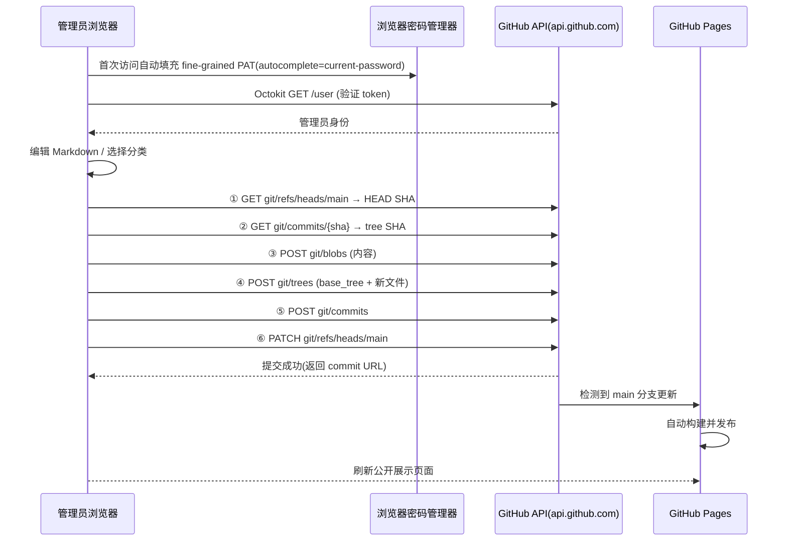
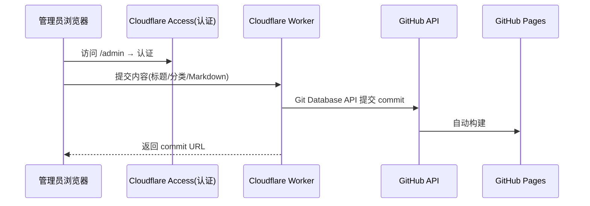

# Real Life Notes — 系统设计报告

> 目标：设计一个"把 GitHub 仓库当作笔记/博客后端、全链路在浏览器中完成内容更新"的系统。管理员只需在网页编辑，系统自动通过 GitHub API 提交 commit，GitHub Pages 自动构建，完成发布。

> **2026-07 设计更新**：主方案已从 Cloudflare Workers 改为 **纯静态**——管理员自带 fine-grained PAT（存放在浏览器密码管理器），前端在浏览器中直接用 Octokit 直调 GitHub API 提交 commit。**零后端、零 secret 管理**，可同时部署于 GitHub Pages / Cloudflare Pages / 任意静态托管。Workers 方案降级为可选备选。

---

## 1. 设计目标与非目标

### 目标
- 管理员**无需本地克隆仓库**、无需 git CLI、无需 push，全部在浏览器完成发布。
- 内容以 **Markdown 文件**存储在 GitHub 仓库，天然可版本回溯、可迁移、不绑定任何平台。
- 公开站点由 GitHub Pages（或 Cloudflare Pages）承载，构建由"push 即触发"完成。
- **项目是纯静态的**：没有后端、没有 Worker、没有隐藏代码运行，可部署在任何静态托管。
- 管理员身份由"谁持有该仓库写权限的 PAT"天然界定；页面本身对所有访客只读。

### 非目标
- 不做复杂的 CMS / 评论 / 用户系统。
- 不自己实现身份认证（不做 OAuth / 登录页；写权限靠管理员本人 PAT）。
- 不在前端存储长期 secret（交给浏览器密码管理器）。
- 不做实时协同编辑。

---

## 2. 总体架构

### 2.1 形态对比

| 形态 | 公开站点 | 管理员入口 | GitHub commit 的发起方 | secret 存放 |
| --- | --- | --- | --- | --- |
| **A（主推）：纯静态全浏览器** | GitHub Pages（或 Cloudflare Pages / 任意静态托管） | 同站的 `/admin` 静态页面 | **浏览器** 用 Octokit 直调 `api.github.com` | 管理员 PAT 存于**浏览器密码管理器** |
| B（备选）：Cloudflare Workers 管理后端 | GitHub Pages 或 Workers | Workers 路由 `/admin` | Workers 服务端 | Worker secret（集中管理） |

形态 A 是核心。形态 B 仅在"希望集中管理 secret / 多管理员共用"时启用，实现时可共享同一套内容模型与提交逻辑。

### 2.2 数据流（形态 A，主链路）



### 2.3 形态 B（备选，Workers）数据流



---

## 3. 仓库结构与内容模型

### 3.1 目录结构（内容仓库 = GitHub Pages 仓库）

```
real-life-notes/
├── index.html              # 公开站点入口
├── admin/                  # 管理界面(纯静态单页)
│   └── index.html
├── content/                # 内容(Markdown)
│   ├── notes/              # 笔记类
│   │   ├── 2026-07-31-my-note.md
│   │   └── ...
│   ├── life/               # 生活类
│   └── work/               # 工作类
└── assets/                 # 静态资源
```

- 分类即目录（或 frontmatter 中的 `category` 字段，二选一，见 §3.2）。
- 文件命名建议：`YYYY-MM-DD-slug.md`。

### 3.2 文件 frontmatter（草案）

```yaml
---
title: 我的第一篇记录
category: life
tags: [随笔, 生活]
date: 2026-07-31
---
正文 Markdown...
```

- 公开站点构建/展示：可配 Jekyll 在 Pages 构建时扫描 `content/`；或做成"运行时用 Contents API 拉取列表"的薄壳（读取无需鉴权，公开仓库即可）。

### 3.3 数据一致性

- **单来源**：GitHub 仓库是唯一数据源，前端直接读写，不引入任何本地数据库副本。
- 浏览器侧只存"正在编辑的文章草稿"（可选，sessionStorage 即可，与 token 无关）。

---

## 4. 身份与 token 管理设计（形态 A 核心）

### 4.1 核心思路

- 不需要登录页，不需要 OAuth。**写权限 = 拥有该仓库 `Contents: write` 的 fine-grained PAT**。
- PAT 存放在**浏览器密码管理器**（Chrome/Edge/Safari/Firefox 内置，或 1Password/Bitwarden 等），而非 localStorage。
- 页面提供一个标准的"token 表单"，让浏览器负责保存与自动填充；前端只负责读取输入框当前值并调用 API。

### 4.2 管理员初始化步骤（一次性）

1. 在 GitHub → Settings → Developer settings → Personal access tokens → **Fine-grained tokens** 生成：
   - Resource owner：自己
   - Repository access：仅 `idealisan/real-life-notes`（本笔记仓库）
   - Permissions：**Contents: Read and write**（Metadata 默认 read）
   - 有效期：按需（可 30 天~1 年或无过期）
2. 打开本站 `/admin`，在"GitHub Token"输入框粘贴，点"连接 GitHub"。
3. 浏览器弹出"保存此密码？"→ 保存（可将登录名记为 `real-life-notes admin`）。

### 4.3 token 表单规范（让密码管理器生效的关键）

```html
<form id="token-form">
  <label for="admin-token">GitHub Token</label>
  <input id="admin-token" name="admin-token"
         type="password"
         autocomplete="current-password"
         placeholder="github_pat_..."
         autocapitalize="off" autocorrect="off" spellcheck="false">
  <button type="submit">连接 GitHub</button>
</form>
```

要点：
- `type="password"` + `autocomplete="current-password"` + **稳定且唯一的 `id`/`name`**（每次构建保持一致，否则密码管理器无法匹配）。
- **不设置 `maxlength`**（避免个别浏览器截断长 token；Firefox 77+ 已不截断粘贴内容）。
- 站点必须 HTTPS（GitHub Pages 默认满足；本地 `localhost` 也算安全上下文）。
- 密码管理器按 origin 匹配，token 不会外泄到其他站点。
- 表单不要用 JS 阻止默认提交行为前把表单放在正常 `<form>` 结构中，否则浏览器可能不弹"保存密码"。

### 4.4 运行时使用流程

- 每次进入 `/admin`，密码管理器自动填充 → 前端监听 `input` 事件读取 `value`。
- 用 `new Octokit({ auth: token })` 持有，**不写入 localStorage / IndexedDB**，仅在内存中保留（每次刷新由密码管理器重新填充）。
- 提供"断开连接"按钮清空内存中的实例（无法删除密码管理器中的条目，那是浏览器的领地）。
- token 校验：`GET /user`；仓库权限校验：`GET /repos/{owner}/{repo}`。

### 4.5 失败与异常

- token 失效/过期 → API 返回 401/403 → 提示"token 无效或已过期，请在 GitHub 重新生成并更新密码管理器"。
- 密码管理器没填充 → 输入框为空 → 提示手动粘贴（首次体验）。

### 4.6 形态 B 的认证（备选）

- Cloudflare Access（Zero Trust）保护 `/admin`，Worker 持有 secret（PAT 或 GitHub App 私钥），前端不接触 token。详见旧版设计 §4（本文不再展开）。

---

## 5. 内容提交流程设计（核心）

### 5.1 写操作（纯前端实现，形态 A）

前端统一封装 `github.ts`，全部走 Octokit：

| 操作 | 使用 API |
| --- | --- |
| 新建文章 | Git Database API（见 §5.2），或单文件时直接 `PUT /contents/{path}` |
| 更新文章 | 同上，需携带旧 blob SHA |
| 删除文章 | `DELETE /contents/{path}`（需要当前 sha）或通过 tree 重写 |
| 列出文章 | `GET /git/trees/{sha}?recursive=1` 或 `GET /contents/{dir}` |
| 读取单篇 | `GET /contents/{path}`（Base64 解码） |

### 5.2 提交实现（Git Database API 六步流）

对"新增/更新/删除"统一实现 `commitChanges(files, message)`：

1. **取基线**：`GET /repos/{owner}/{repo}/git/refs/heads/{branch}` → HEAD SHA。
2. **取树**：`GET /repos/{owner}/{repo}/git/commits/{HEAD}` → 当前 tree SHA。
3. **上传 blob**（可并行）：`POST /git/blobs`，每个文件 `{content, encoding:"utf-8"}`。
4. **建树**：`POST /git/trees`，body `{base_tree: 第2步tree, tree:[{path, mode:"100644", type:"blob", sha}]}`。删除则列出带旧 blob SHA 的条目；**必须带 base_tree，否则丢文件**。
5. **建 commit**：`POST /git/commits`，body `{message, tree, parents:[HEAD]}`。
6. **更新 ref**：`PATCH /git/refs/heads/{branch}`，body `{sha: 新 commit}`。

> 备选简化：单文件改动可直接用 `PUT /contents/{path}`（一次请求），作为实现降级路径。

### 5.3 并发与冲突

- GitHub 乐观锁：Contents API 靠文件 `sha`；Git Database 流程靠"第 1 步的 HEAD 与第 6 步更新 ref 之间冲突检测"。
- 收到 `409 Conflict` → 重新执行第 1~2 步取最新基线再提交一次（重试上限 2~3 次）。单人使用基本不会触发。

### 5.4 提交身份

- 使用 PAT 时默认记为该 token 拥有者（管理员本人）。
- 可在 Contents / Git Database 请求中显式传 `author`/`committer`（name/email/date）覆盖。

### 5.5 错误处理

- 4xx（鉴权失败、权限不足、路径冲突）→ 明确提示管理员。
- 5xx / 网络超时 → 提示"提交失败，请重试"；整体流程幂等，重试前重新取基线。

---

## 6. 前端管理界面（草案）

- 技术：Vite + 原生 TS（单文件、无框架亦可）；Markdown 渲染用 `marked`/`markdown-it` + DOMPurify；Octokit 用 `octokit/rest.js`（浏览器版）。
- 页面：
  - `/admin` — token 连接区（§4.3 表单）+ 文章列表（分类过滤、搜索、编辑/删除入口）
  - `/admin/new` — 编辑器（标题、分类、标签、Markdown 正文、预览）
  - `/admin/edit/:path` — 编辑既有文章
- 状态反馈：提交中 loading、成功展示 commit 链接（`html_url`）、失败原因。
- 由于是静态页，路由用 hash 或 query（`/admin#/edit/...`）避免服务器配置 SPA fallback。

---

## 7. 构建与发布链路

### 7.1 GitHub Pages（主）

- Pages → Source = **Deploy from a branch**，选 `main`。
- 每次 commit 推送到 `main`，GitHub 自动构建（Jekyll 或自定义静态生成器），无需本项目参与。
- 纯静态展示备选：站点运行时用 Contents API 拉取 `content/` 列表与文章渲染，让 Pages 变成"薄壳"，连构建逻辑都不需要。

### 7.2 Cloudflare Pages / 其他静态托管（备选）

- 静态方案与托管平台无关：把构建产物推到任何静态托管即可，`/admin` 依旧用浏览器直调 API。**形态 A 下甚至不需要 Cloudflare**。

### 7.3 不做

- 不用 `POST /pages/deployments`（需 GitHub Actions 签发的 OIDC token，见资源分析报告 §2.5）。

---

## 8. 技术栈建议

| 层 | 选型 |
| --- | --- |
| 前端 | Vite + 原生 TS（或 React），纯静态单页 |
| GitHub 客户端 | `octokit/rest.js`（浏览器版） |
| Markdown | `marked` / `markdown-it` + `dompurify` |
| token 载体 | 浏览器密码管理器（`autocomplete="current-password"`） |
| 部署 | GitHub Pages（build 产物推 `main`）；或任意静态托管 |
| 可选：服务端模式 | Cloudflare Workers + Cloudflare Access（形态 B） |

---

## 9. 安全考虑

| 风险 | 缓解措施 |
| --- | --- |
| token 落库/落盘 | 前端**不写 localStorage/IndexedDB**，只存密码管理器；GitHub 侧仅授权本仓库 Contents 读写 |
| token 被脚本读取 | 项目本身零第三方脚本；`/admin` 页面设置 CSP 限制内联脚本与外部来源，降低 XSS 面 |
| XSS（编辑预览） | Markdown 渲染后经 DOMPurify 消毒，不渲染原始 HTML |
| token 失效/泄露 | GitHub 侧可随时在 PAT 页吊销；fine-grained token 推入公共仓库会自动吊销；建议设过期 |
| 分支保护 | 在 GitHub 上为 `main` 配置分支保护，禁止 force push |
| 密码管理器不生效 | 遵循 §4.3 表单规范（autocomplete、稳定 id/name、无 maxlength、HTTPS、form+submit） |
| 误把 token 提交进仓库 | 检查前端不得把 `input.value` 写入内容；`.gitignore` 无关（token 本就不落盘） |
| 限流 | 未认证 60 次/时；认证后 5000 次/时，个人场景充足 |

---

## 10. 分期实施计划

### M1 — 最小闭环（验证可行性）
- 建 `content/` 目录 + 一篇示例文章。
- GitHub Pages 配置 "Deploy from a branch"（`main`）。
- `/admin` 最小页：token 表单（密码管理器规范）+ Octokit 连接 + 六步提交"新建文章"。
- **验收标准**：浏览器里粘贴 token 保存进密码管理器后，点一次发布，1~3 分钟内公开展示页出现新文章。

### M2 — 管理界面
- 文章列表（Contents/tree API）、编辑、删除、预览。
- 错误处理与 409 重试。

### M3 — 打磨
- 分类/标签体系、搜索、样式；CSP 与安全加固。
- （可选）打包发布脚本：本地 build → 推送 `main`。

### M4 —（可选）形态 B / 多管理员
- 迁移到 Cloudflare Workers + Access，集中管理 secret；或保持纯静态不变。

---

## 11. 未决问题 / 风险登记

| 项 | 说明 | 状态 |
| --- | --- | --- |
| 公开站点的构建方式 | Jekyll / 静态生成器 / 运行时拉取 Contents 三选一 | 待定，M2 前决定 |
| 分类的表达 | 目录 vs frontmatter 字段 | 建议 frontmatter + 目录两者共存 |
| 密码管理器兼容性细节 | 各浏览器对"保存密码"的触发条件略有差异，需实测 | M1 验收项 |
| 图片等二进制资源 | 需 Base64 blob 上传，单文件上限 100MB | 照片类场景需单独方案 |
| token 无过期 vs 定期轮换 | 长期 token 简单但风险窗口大 | 建议设过期 + 提醒刷新 |

---

## 12. 结论

- **技术路线可行且更简单**：GitHub API（Contents + Git Database）完全支持无克隆提交 commit；`api.github.com` 开放 CORS；GitHub token（最长 ~255 字符）放进浏览器密码管理器绰绰有余；GitHub Pages "push 即构建"让闭环成立。
- **主方案**：纯静态单页 + 浏览器密码管理器存 fine-grained PAT + 前端 Octokit 直调 GitHub API + GitHub Pages 自动构建。零后端，同时适配 GitHub Pages 与 Cloudflare Pages。
- **备选**：Cloudflare Workers 集中管理 secret（多管理员场景）。
- **遗留明确项**：公开站点构建方式、分类体系、密码管理器兼容性实测——均在 M1~M2 落地。
