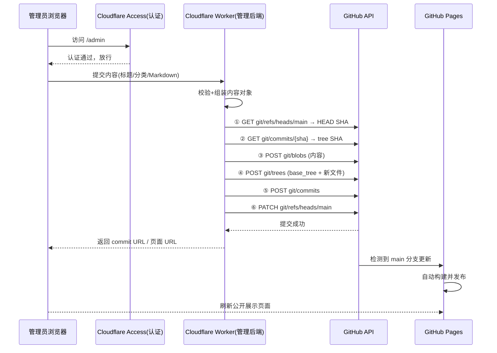
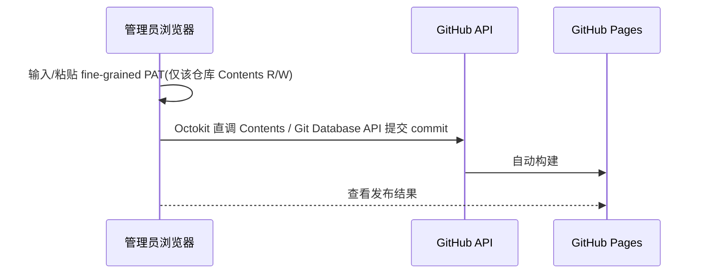

# Real Life Notes — 系统设计报告

> 目标：设计一个"把 GitHub 仓库当作笔记/博客后端、全链路在浏览器中完成内容更新"的系统。管理员只需在网页编辑，系统自动通过 GitHub API 提交 commit，GitHub Pages 自动构建，完成发布。

---

## 1. 设计目标与非目标

### 目标
- 管理员**无需本地克隆仓库**、无需 git CLI、无需 push，全部在浏览器完成发布。
- 内容以 **Markdown 文件**存储在 GitHub 仓库，天然可版本回溯、可迁移、不绑定任何平台。
- 公开站点由 GitHub Pages（或 Cloudflare Pages）承载，构建由"push 即触发"完成。
- 管理员路径有独立身份认证，普通访客只能读、不可写。

### 非目标
- 不做复杂的 CMS / 评论 / 用户系统。
- 不自己实现身份认证（交由 Cloudflare Access 等承载，见 §4）。
- 不做实时协同编辑。

---

## 2. 总体架构

### 2.1 两种部署形态

| 形态 | 公开站点 | 管理员入口 | 认证承载 | GitHub commit 的发起方 |
| --- | --- | --- | --- | --- |
| **A（推荐）：Cloudflare Workers 全包** | Workers 直接渲染静态站点（或反向代理 Pages） | Workers 路由 `/admin` | Cloudflare Access | Workers 服务端（secret 不落地浏览器） |
| **B：GitHub Pages 公开展示 + Workers 仅管后台** | GitHub Pages | 独立域名/子路径指向 Worker | Cloudflare Access | Workers 服务端 |
| **C（备选/试验）：纯前端直调** | GitHub Pages | GitHub Pages 上的 `/admin` 页面 | 前端在管理员手动持有 fine-grained PAT | 浏览器用 Octokit 直调 API |

A/B 是主推形态（安全、secret 不出服务端）；C 作为简化实验路径，token 仅存在于浏览器，需接受其安全折衷（详见 §9）。

### 2.2 数据流（形态 A/B，主链路）



### 2.3 形态 C（纯前端）数据流



---

## 3. 仓库结构与内容模型

### 3.1 目录结构（内容仓库 = GitHub Pages 仓库）

```
real-life-notes/
├── index.html              # 公开站点入口（构建后产物或源码）
├── content/
│   ├── notes/              # 笔记类
│   │   ├── 2026-07-31-my-note.md
│   │   └── ...
│   ├── life/               # 生活类
│   ├── work/               # 工作类
│   └── ...
├── assets/                 # 静态资源
└── admin/                  # 管理界面（如采用形态 B/C 时放这里）
```

- 分类即目录（或 frontmatter 中的 `category` 字段，二选一，见 §3.2）。
- 文件命名建议：`YYYY-MM-DD-slug.md`，时间可排序、天然唯一。

### 3.2 文件 frontmatter（草案）

```yaml
---
title: 我的第一篇记录
category: life
tags: [随笔, 生活]
date: 2026-07-31
---
正文 Markdown...
```

- 索引/列表：公开站点构建时扫描 `content/` 生成（GitHub Pages 可配 Jekyll，或直接用静态站点生成器在 Pages 构建；也可做成"前端运行时通过 Contents API 拉取列表"的纯静态方案）。

### 3.3 数据一致性

- **单来源**：GitHub 仓库是唯一数据源。所有读写都直接对仓库，不引入 KV 数据库副本（避免双写不一致）。KV 仅用于缓存（如 installation token、页面列表缓存）。

---

## 4. 认证与授权设计

> 设计原则：项目自身只识别"已认证"与"未认证"，不实现认证逻辑。

- **承载层**：Cloudflare Access（Zero Trust）把 `/admin*` 路由保护起来，支持邮箱 OTP、Google、GitHub、SSO 等多种身份源；管理员登录后由 Access 放行。
- **放行后的身份**：Access 会把 JWT（`CF-Access-Jwt-Assertion`）传给 Worker，Worker 可校验并据此识别管理员（亦可仅信任 Access 的网关作用）。
- **开发环境**：`wrangler dev` 本地无 Access，允许配置 `ADMIN_BYPASS=true` 仅用于本地联调，**生产必须关闭**。
- **备选**：若不用 Access，Worker 内可自建轻量会话（登录密码 → 加密 Cookie / session），但属于本项目的额外负担，不建议。

---

## 5. 内容提交流程设计（核心）

### 5.1 写操作 API（Workers 形态）

Workers 暴露以下管理端点（全部在 Access 保护之后）：

| 方法 | 路径 | 作用 |
| --- | --- | --- |
| `POST` | `/admin/api/posts` | 新建文章（标题/分类/正文）→ 提交 commit |
| `PUT` | `/admin/api/posts/:path` | 更新文章（需附带旧 blob SHA 做乐观锁） |
| `DELETE` | `/admin/api/posts/:path` | 删除文章 |
| `GET` | `/admin/api/posts` | 列出文章（走 Contents/tree API） |
| `GET` | `/admin/api/posts/:path` | 读取单篇（编辑用） |
| `POST` | `/admin/api/posts/:path/preview` | 返回渲染后的 HTML（可选） |

### 5.2 提交实现（Git Database API 四步流）

对"新增/更新/删除"统一实现一个 `commitChanges(files, message)` 函数：

1. **取基线**：`GET /repos/{owner}/{repo}/git/refs/heads/{branch}` → HEAD SHA。
2. **取树**：`GET /repos/{owner}/{repo}/git/commits/{HEAD}` → 当前 tree SHA。
3. **上传 blob**（可并行）：`POST /git/blobs`，每个文件 `{content, encoding:"utf-8"}`。
4. **建树**：`POST /git/trees`，body `{base_tree: 第2步tree, tree:[{path, mode:"100644", type:"blob", sha}]}`。删除则列出带旧 blob SHA 的条目；**必须带 base_tree，否则丢文件**。
5. **建 commit**：`POST /git/commits`，body `{message, tree, parents:[HEAD]}`。
6. **更新 ref**：`PATCH /git/refs/heads/{branch}`，body `{sha: 新 commit}`，`force:false`。

> 备选简化：单文件改动可直接用 `PUT /contents/{path}`（一次请求），作为实现降级路径。

### 5.3 并发与冲突

- GitHub 侧有内置乐观锁：Contents API 靠文件 `sha`；Git Database 流程靠"第 1 步取的 HEAD 与第 6 步更新 ref 之间的冲突检测"。
- 收到 `409 Conflict` 时：重新执行第 1~2 步取最新基线再提交一次（至多重试 2~3 次）。单人使用场景基本不会触发。

### 5.4 提交身份

- 使用 **GitHub App** 时：commit 会记录为 App bot 身份，`author/committer` 也可显式覆盖为管理员名（Git Database API 的 commit 对象可带 `author`/`committer`）。
- 使用 **fine-grained PAT** 时：默认记为该 token 拥有者，亦可显式传 `committer`。
- 建议：commit message 统一格式 `[notes] <title> (create|update|delete)`。

### 5.5 错误处理

- GitHub API 4xx（鉴权失败、权限不足、路径冲突）→ 明确提示给管理员。
- 5xx / 网络超时 → 返回"提交失败，请重试"，并保证可安全重试（整体流程幂等，重试前重新取基线）。

---

## 6. 前端管理界面（草案）

- 技术：单页应用（Vite/React 或原生 TS），与后端形态解耦（API 层可插拔：Worker 服务端 或 浏览器直调）。
- 页面：
  - `/admin` — 文章列表（分类过滤、搜索、编辑/删除入口）
  - `/admin/new` — 编辑器（标题、分类、标签、Markdown 正文、预览）
  - `/admin/edit/:path` — 编辑既有文章
- 编辑器：Textarea + 预览（Markdown 渲染库），发布按钮触发 §5 的提交。
- 状态反馈：提交中 loading、成功展示 commit 链接（`html_url`）、失败原因。

---

## 7. 构建与发布链路

### 7.1 GitHub Pages（主）

- Pages → Source = **Deploy from a branch**，选 `main`。
- 每次 commit 推送到 `main`，GitHub 自动构建（Jekyll 或自定义静态生成器均可），无需本项目参与。
- 纯静态展示方案备选：站点运行时用 Contents API 拉取 `content/` 列表与文章渲染，让 Pages 变成"薄壳"，此时公开站点也无需构建逻辑。

### 7.2 Cloudflare Pages（备选）

- 内容仓库接入 Cloudflare Pages（Git 集成），push 即自动构建，部署产物托管在 Cloudflare 边缘。
- 管理端 Worker 与 Pages 可同仓不同分支或独立 Worker，注意避免相互触发死循环（分支分开即可）。

### 7.3 不做

- 不用 `POST /pages/deployments`（需 GitHub Actions 签发的 OIDC token，Cloudflare 侧拿不到，见资源分析报告 §2.5）。

---

## 8. 技术栈建议

| 层 | 选型 |
| --- | --- |
| 管理后端 | Cloudflare Workers（Hono 或原生 fetch router） |
| GitHub 客户端 | 服务端：`@octokit/rest`（或直接用 fetch）；浏览器：`octokit/rest.js` |
| 认证 | Cloudflare Access（Zero Trust），Worker 内校验 `CF-Access-Jwt-Assertion`（可选） |
| 前端 | Vite + 原生 TS / React，Markdown 渲染用 `marked`/`markdown-it` |
| 部署 | `wrangler deploy`；Workers 代码本身由 GitHub Actions + `cloudflare/wrangler-action` 自动部署 |
| 配置/secret | `GITHUB_TOKEN`（fine-grained PAT）或 `GITHUB_APP_ID` + `GITHUB_APP_PRIVATE_KEY` |

---

## 9. 安全考虑

| 风险 | 缓解措施 |
| --- | --- |
| token 泄露（服务端形态） | token 只存 Workers secret；GitHub 侧仅授权"目标仓库 Contents 读写"；GitHub App 模式 token 1h 过期 + KV 缓存 |
| token 泄露（浏览器直调形态） | 仅限细粒度 PAT + 仅该仓库权限；尽量只在内存持有、不写 localStorage；明确文档提示风险 |
| XSS | 管理界面不做危险 HTML 渲染；预览渲染前做转义/消毒（DOMPurify） |
| CSRF | 写操作仅允许同源 + 校验 Access 携带的 JWT；状态变更端点拒绝无凭据请求 |
| 越权调用 GitHub API | Worker 只允许已认证的管理员路径调用；API 层做路径白名单（仅允许写入 `content/` 下） |
| 限流 | Workers 配额对个人场景绰绰有余；GitHub API 5000 次/h 足够 |
| 分支保护 | 建议在 GitHub 上为 `main` 配置分支保护，禁止直接 force push 覆盖 |

---

## 10. 分期实施计划

### M1 — 最小闭环（验证可行性）
- Workers 单文件：认证（Access 或本地 bypass）+ `POST /admin/api/posts` + Git Database API 提交到 `main`。
- GitHub Pages 配置 "Deploy from a branch"。
- 手工 curl 验证：提交后 Pages 自动更新。
- **验收标准**：浏览器里点一次发布，1~3 分钟内公开展示页出现新文章。

### M2 — 管理界面
- `/admin` 前端：列表、新建、编辑、删除、预览。
- 后端补齐 `GET/PUT/DELETE` 端点与错误处理。

### M3 — 打磨
- 分类/标签体系、搜索、Markdown 预览与样式。
- KV 缓存（installation token / 列表）、重试与冲突处理。
- 接入 Cloudflare Access 正式保护 `/admin`。

### M4 —（可选）GitHub App 化 / 多管理员
- 迁移到 GitHub App 安装认证，支持多管理员、审计 commit 归属。

---

## 11. 未决问题 / 风险登记

| 项 | 说明 | 状态 |
| --- | --- | --- |
| 公开站点的构建方式 | Jekyll / 静态生成器 / 运行时拉取 Contents 三选一 | 待定，M2 前决定 |
| 分类的表达 | 目录 vs frontmatter 字段 | 建议 frontmatter + 目录两者共存，列表以 frontmatter 为主 |
| 纯浏览器形态（C）是否保留 | 安全折衷明显，仅作实验/离线场景 | 默认不做，除非有明确需求 |
| 图片等二进制资源 | 需走 Base64 blob 上传，体积受限（Contents API 单文件上限 100MB） | 照片类场景需单独方案（如走 OSS/图床） |
| Workers 形态下公开站点是否也由 Worker 出 | 形态 A 中 Worker 可同时服务公开页与 admin，减少一个部署实体 | 与 Pages 方案二选一 |

---

## 12. 结论

- **技术路线可行**：GitHub API（Contents + Git Database）完全支持无克隆提交 commit；`api.github.com` 开放 CORS；Cloudflare Workers 可在服务端持有 secret 并调 API；GitHub Pages "push 即构建"让闭环成立。
- **推荐主路线**：Cloudflare Workers 管理端 + Cloudflare Access 认证 + Git Database API 提交 + GitHub Pages 自动构建，全程浏览器操作、零本地仓库。
- **遗留明确项**：公开站点构建方式、分类体系、GitHub App 化——均可在后续迭代中按 §10 分期落地。
